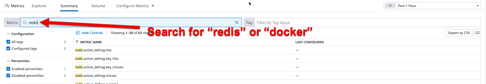

# Using Docker Compose with Datadog

Datadog offers native Docker container monitoring, either by running the Agent
on the host or running in a sidecar container. Which is the best way to run it?
It ultimately depends on the tooling you have in place to manage the Agent's
configuration. If you want to go Docker all the way, you can run the Agent as
a sidecar and control its configuration with custom `Dockerfiles`.

Let's see what it looks like.

# Starting off from the Compose example

To build a meaningful setup, we start from the [example](https://docs.docker.com/compose/#overview)
that Docker put together to illustrate Compose. A simple Python web application that
connects to Redis to store the number of hits.

Here is the `docker-compose.yml` that powers the whole setup.

```yaml
version: "4"
services:
  web:
    build: web
    command: ddtrace-run python app.py
    ports:
     - "5000:5000"
    volumes:
     - ./web:/code # modified here to take into account the new app path
    links:
     - redis
    environment:
     - DATADOG_HOST=datadog # used by the web app to initialize the Datadog library
     - DD_AGENT_HOST=dd-agent # points to dd-agent to send traces
  redis:
    image: redis
  # agent section
  datadog:
    container_name: dd-agent
    build: datadog
    links:
     - redis # ensures that redis is a host that the container can find
     - web # ensures that the web app can send metrics
    environment:
     - DD_API_KEY=__your_datadog_api_key_here__
     - DD_DOGSTATSD_NON_LOCAL_TRAFFIC=true # enables agent to receive custom metrics from other containers
     - DD_APM_ENABLED=true # enables tracing
     - DD_APM_NON_LOCAL_TRAFFIC=true # enables agent to receive traces from other containers
     - DD_AGENT_HOST=dd-agent # allows web container to forward traces to agent
     - DD_SITE=datadoghq.com # determines datadog instance to send data to (e.g change to datadoghq.eu for EU1)
    volumes:
     - /var/run/docker.sock:/var/run/docker.sock
     - /proc/:/host/proc/:ro
     - /sys/fs/cgroup:/host/sys/fs/cgroup:ro
```

# Configuring the Agent

Because the Agent needs to monitor Redis it needs:

1. The proper `redisdb.yaml` in the container's `/etc/datadog-agent/conf.d` to find the Redis node.

The Agent's `Dockerfile` takes care of #1.

```
FROM datadog/agent:latest
ADD conf.d/redisdb.yaml /etc/datadog-agent/conf.d/redisdb.yaml
```

2. And the Compose yaml files creates the link to Redis with:

```yaml
  links:
    - redis
```

# Configuring APM

The Agent needs the following in order to collect Python traces from the `web` container:

1. The `ddtrace` library. 

This can be achieved by adding the following to the `requirements.txt` for our `web` app. The `datadog` is used to collect our custom (`dogstatsd`) metrics

```
flask
redis
datadog
ddtrace <--
```

2. Tags that identify the app and its origin. 

This can be achieved by simply adding a few environment variables to the `web` container's `Dockerfile`.

```dockerfile
FROM python:2.7
ADD . /code
WORKDIR /code
RUN pip install -r requirements.txt

# This is where you set DD tags
ENV DD_SERVICE web        <-- This sets the "service" name in Datadog
ENV DD_ENV sandbox        <-- This sets the "env" name in Datadog
ENV DD_VERSION 1.0        <-- This sets the "version" number in Datadog
```

3. Environment variables & container name set to ensure connection between your app container and the Agent. 

You will want to make sure that the `DD_AGENT_HOST` environment variables set in your `docker-compose.yml` are the same for both the Agent  and your app container. 

Also set the `container_name` for the `datadog` container to be the same as this `DD_AGENT_HOST` value. 

# All in one

How to test this?

1. [Install Docker Compose](https://docs.docker.com/compose/install/)
1. Clone this repository
1. Update your `DD_API_KEY` in `docker-compose.yml`
1. Run all containers with `docker-compose up`
1. Refresh `localhost:5000` a few times in your web browser to generate some traces. 
1. Verify in Datadog that your container picks up the Docker & Redis metrics along with all the APM traces. 
  - An easy way to verify you are receiving these metrics is by visiting the `Metrics Summary` page. Navigate to `Metrics -> Summary`, then search for either `docker` or `redis` to see if any metrics appear. See example below.

  

  - An easy way to verify you are receiving APM traces is by visiting the `Trace Explorer` page. Navigate to `APM -> Traces -> Explorer` and you should see a list of traces. If you click on a trace, your flame graph should look like this. 

  